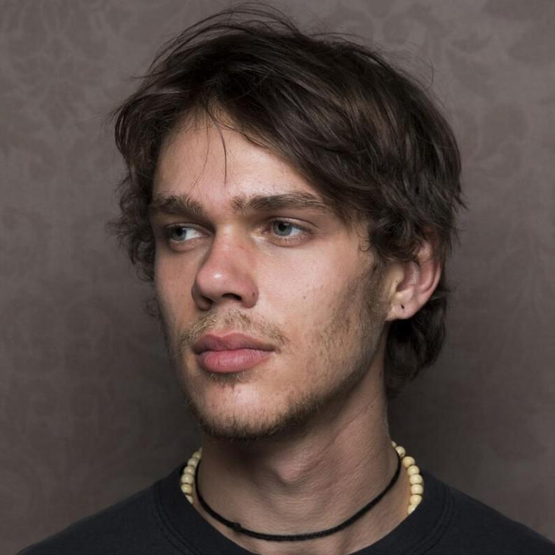

# Personal Face Generator


## Sample Output

### Ellar Coltrane


#### Real Images

<table class="center">
<tr>
  
<tr>
<td>


</td>
<td>


</td>
<td>


</td>


<tr>
<td>


</td>
<td>


</td>


</tr>
</table>


#### Genrated Fake Images

<table class="center">
<tr>
  
<tr>
<td>


</td>
<td>


</td>
<td>


</td>


<tr>
<td>


</td>
<td>


</td>


</tr>
</table>


## Installation

1. Clone the repository

```
git clone <URL of repository>
```

2. Install pip

```
sudo apt update
sudo apt upgrade
sudo apt-get install python3-pip tmux
```

3. Install virtualenv, create ans activate a virtual environment

```
sudo pip install virtualenv 
virtualenv venv 
source venv/bin/activate
```

4. Install [**diffusers** ](https://github.com/huggingface/diffusers) from source

```
git clone https://github.com/huggingface/diffusers
cd diffusers
pip install -e .

```

5. Install [**dreambooth**](https://github.com/huggingface/diffusers/tree/main/examples/dreambooth) requirements

```
cd examples/dreambooth/
pip install -r requirements.txt
```

6. Before downloding the model, you need to install Git Large File Storage (LFS):

```
curl -s https://packagecloud.io/install/repositories/github/git-lfs/script.deb.sh | sudo bash
sudo apt-get install git-lfs
git-lfs install
```

7. Download the model [Stable Diffusion v1-5](https://huggingface.co/runwayml/stable-diffusion-v1-5/tree/fp16) from HuggingFace - Floating Point 16

```
git clone -b fp16 https://huggingface.co/runwayml/stable-diffusion-v1-5
```

8. Install these Python packages:


```
pip install notebook
pip install bitsandbytes
pip install xformers
pip install gradio
```


    
## Deployment


1. Choose at least 3 images of a person and locate them in a directory

2. Configurate accelerate (by default)

```
accelerate config
```

3. Train the model with your personal images (Run ```run.sh```):

```
export MODEL_NAME="./stable-diffusion-v1-5"
export INSTANCE_DIR="./instance_images"
export CLASS_DIR="./class_images/man"
export OUTPUT_DIR="./models/finetuned/person1"


accelerate launch train_dreambooth.py \
  --pretrained_model_name_or_path=$MODEL_NAME  \
  --instance_data_dir=$INSTANCE_DIR \
  --class_data_dir=$CLASS_DIR \
  --output_dir=$OUTPUT_DIR \
  --with_prior_preservation --prior_loss_weight=1.0 \
  --instance_prompt="a photo of sks man" \
  --class_prompt="a photo of man" \
  --resolution=512 \
  --train_batch_size=1 \
  --gradient_accumulation_steps=1 --gradient_checkpointing \
  --use_8bit_adam \
  --enable_xformers_memory_efficient_attention \
  --set_grads_to_none \
  --learning_rate=2e-6 \
  --lr_scheduler="constant" \
  --lr_warmup_steps=0 \
  --num_class_images=200 \
  --max_train_steps=1200 \
  --train_text_encoder
```


## Feedback and support

If you have any feedback or need support, please reach out to us at hasanghaffari93@gmail.com

